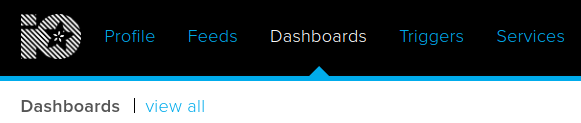
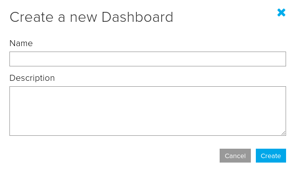
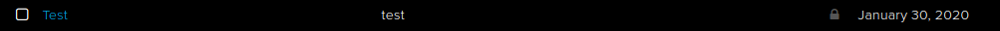
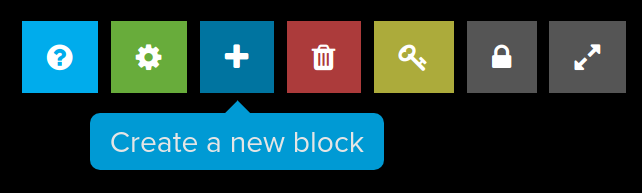
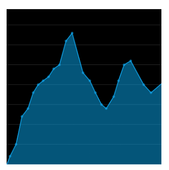
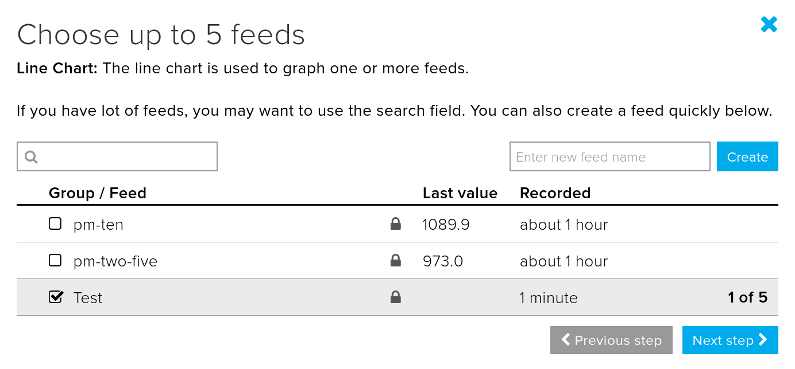
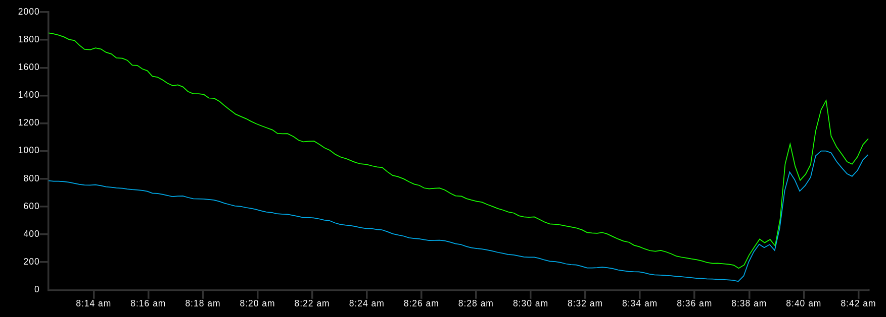
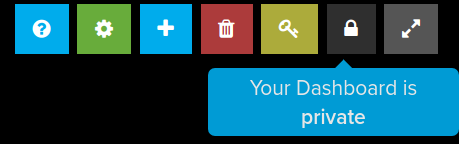
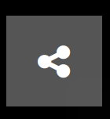

--- task ---

If you haven't already created an Adafruit account and created a feed, then have a look at this link - https://projects.raspberrypi.org/en/projects/adafruit-io-feeds

--- /task ---

--- task ---

Login to https://io.adafruit.com

--- /task ---

--- task ---

Click on **Dashboards** and then **view all**.

--- /task ---

--- task ---

Click on **Actions** and then select **Create a new dashboard** from the menu.

--- /task ---

--- task ---

Give your dashboard a name and a description and then click **Create**.

--- /task ---

--- task ---

Click on your newly created dashboard in the table of available dashboards.

--- /task ---

--- task ---

You will now see your blank dashboard. Notice the small icons in the top right.

--- /task ---

--- task ---

Click on the **Create a new block** icon.

For this example the **Line Chart** block will be selected.

--- /task ---

--- task ---

Choose up to five feeds to be included in your dashboard.

Click on **Next step>**.

--- /task ---

--- task ---

You now have the option to add labels and select time constants for your block.

--- /task ---

--- task ---

Your feed data should be shown in the block. You can also edit the layout to resize the block, add more blocks, and position them.

--- /task ---

--- task ---

You can unlock your dashboard by clicking the unlock icon.

And then use the **Share** icon to get a shareable URL for your dashboard.

--- /task ---

