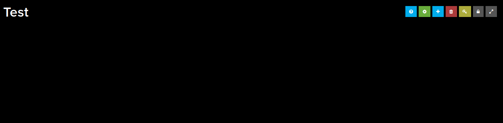
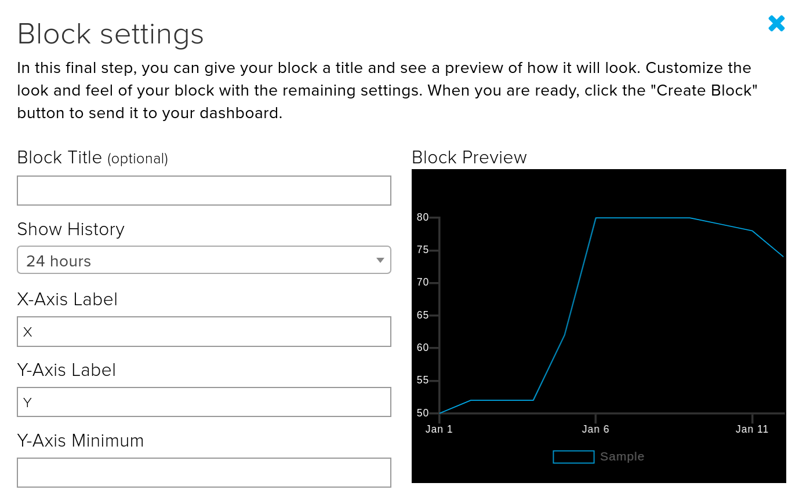

- If you haven't already created an Adafruit account and created a feed, then have a look at this link - https://projects.raspberrypi.org/en/projects/adafruit-io-feeds

- Login to https://io.adafruit.com

- Click on **Dashboards** and then **view all**.

- Click on **Actions** and then select **Create a new dashboard** from the menu.

- Give your dashboard a name and a description and then click **Create**.

- Click on your newly created dashboard in the table of available dashboards.

- You will now see your blank dashboard. Notice the small icons in the top right.

- Click on the **Create a new block** icon.

- For this example the **Line Chart** block will be selected.

- Choose up to five feeds to be included in your dashboard.

Click on **Next step>**.

- You now have the option to add labels and select time constants for your block.

- Your feed data should be shown in the block. You can also edit the layout to resize the block, add more blocks, and position them.

- You can unlock your dashboard by clicking the unlock icon.

- And then use the **Share** icon to get a shareable URL for your dashboard.

